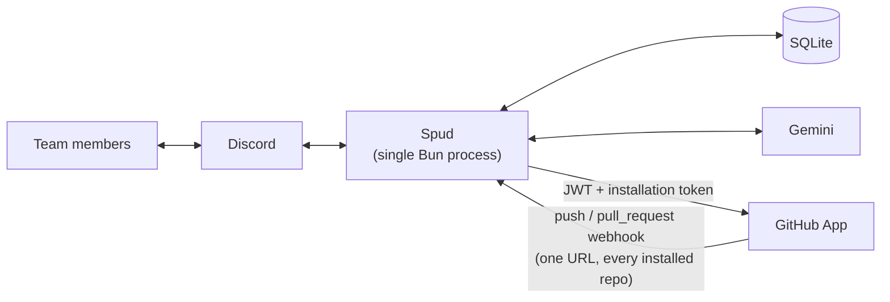
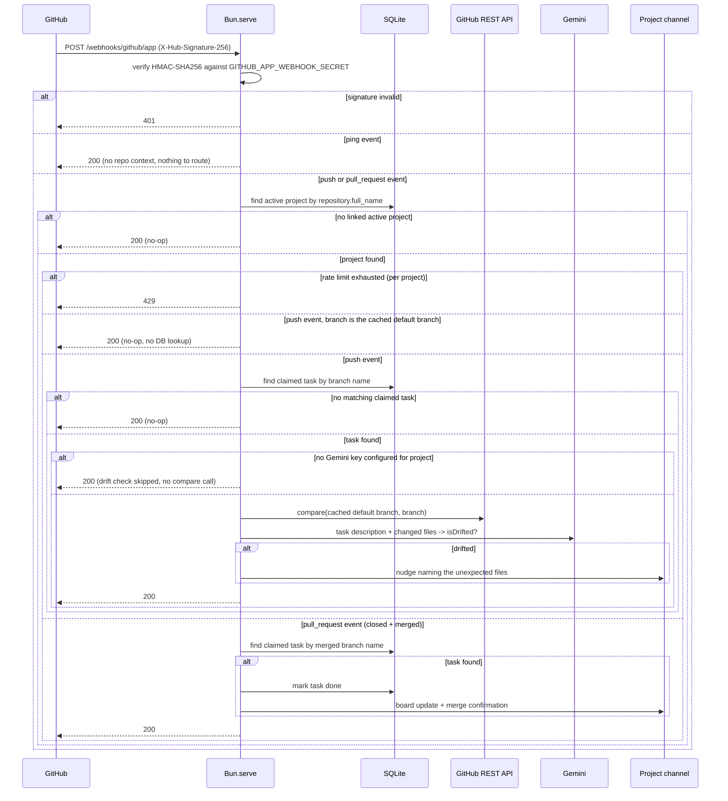

# Spud

A Discord bot for small team task coordination — a live claim board that shows who's working on what, catches two people building the same feature before it happens, and nudges someone if their branch quietly drifts outside the task they claimed.

**[Add Spud to your server](https://discord.com/oauth2/authorize?client_id=1528332173378326671&permissions=10240&scope=bot%20applications.commands)** — not listed in Discord's App Directory yet, but the invite link works the same either way. Run `/help` once it's in.

## Features

### Project Lifecycle

A project is scoped to a **channel**, not the whole server, so one Discord server can host multiple concurrent projects/teams without collision. No task command works until someone starts one.

| Command | Access | Description |
|---|---|---|
| `/project start <title> <github-repo>` | Anyone | Starts a new active project in this channel, linking a GitHub repo the [GitHub App](#github-app-authentication) is already installed on. Whoever runs it becomes the project's **team lead** |
| `/project configure [start-time] [end-time] [handbook]` | Team lead only | Sets or updates the project's timeline (parsed from natural language via `chrono-node`, e.g. "July 25 9am") and handbook file. Any subset of fields can be provided per call |
| `/project end` | Team lead only | Ends the active project, archives (doesn't delete) its board/task data, unpins the board |
| `/project status` | Team lead only | Shows the active project's title, repo, task counts, timeline, and handbook link |
| `/project list` | Server admin | Lists all active projects across the server (bird's-eye view, ephemeral) |
| `/project set-gemini-key` | Team lead only | Opens a modal to set or remove this project's own Gemini API key, enabling/disabling AI features |

`/project start` is open to anyone — whoever runs it in a channel becomes that project's team lead, no `Administrator` permission required. `/project configure`, `/project end`, and `/project status` are then restricted to that specific Discord member — with **no admin override**. Only `/project list` requires Discord's `Administrator` permission, since it's a cross-channel, server-wide view. This mixed anyone/team-lead/admin model can't be expressed through Discord's per-command default-permission system (which applies to a whole command, not per-subcommand), so it's enforced in application code instead (see [authorization.ts](src/discord/authorization.ts)). A channel can only have one *active* project at a time, **and a repo can only be linked to one active project at a time** — both enforced at the database level (partial unique indexes), not just in application code. The latter is also what lets the GitHub App's webhook (one URL for every installed repo) resolve an incoming event to exactly one project.

Team lead has no reassignment path yet — if the team lead leaves the server, `/project configure`/`end`/`status` become permanently unusable for that project (no admin fallback, no migration tool to patch it).

`/project start` only takes the bare minimum (title + repo); timeline and handbook are set separately via `/project configure` since they might not be decided yet when the project is created. `/claim` refuses to run until both `start-time` and `end-time` are set. Timeline input is natural language (no timezone support — everything is parsed relative to the process's own local time), and the handbook file is re-posted as a message in the project channel rather than storing the raw attachment URL, since Discord's CDN URLs carry a signed expiry but a message can always be re-fetched (or jumped to) for a fresh one.

### Claim Board

A pinned, auto-updating embed in the project's channel with three sections: 🟢 up for grabs, 🔧 in progress, ✅ done. It's created and pinned the moment `/project start` runs, and re-rendered on every claim/done/free/delete.

| Command | Description |
|---|---|
| `/claim <description>` | Claims an existing unclaimed task (autocompletes matching descriptions), or creates and claims a new one |
| `/tasks` | Shows the current board state on demand |
| `/done <branch>` | Marks a claimed task done (autocompletes claimed branches) |
| `/free <branch>` | Releases a claimed task back to unclaimed (autocompletes claimed branches) |
| `/delete <branch>` | Deletes a task of any status — unclaimed, claimed, or done (autocompletes across all branches) |

**Authorization:** `/done`, `/free`, and `/delete` only work for the task's current owner or a server admin — anyone else gets turned away. The one exception is deleting an *unclaimed* task, which has no owner to match against, so that specific case is admin-only.

### AI features (Gemini)

Overlap detection, branch naming, and scope-drift nudges (both described below) all run on Gemini — but Spud doesn't hold its own Gemini key. Each project supplies its own via `/project set-gemini-key`, collected through a Discord **modal** rather than a plain command option (a typed option's value shows up in the channel even with an ephemeral reply; a modal submission never does), and stored encrypted (see "Encryption at rest" below). Submitting an empty value clears it.

Without a key set, AI features are simply unavailable for that project rather than erroring — see each feature's fallback below.

### Overlap Detection + Branch Naming

When `/claim` is given free text that doesn't match an existing unclaimed task, it's treated as a brand-new task and a single Gemini call ([`llm/claim-analysis.ts`](src/llm/claim-analysis.ts)) does two things at once:

1. **Overlap check** — compares the new description against every other task's description on the board, regardless of status (unclaimed, claimed, or done). If it looks like a duplicate, the claim is **rejected** (not just warned) with a message naming the existing owner/task/branch and a nudge to retry with more detail.
2. **Branch naming** — generates a deterministic `type/kebab-slug` branch name (`feature`, `fix`, `chore`, `docs`, or `refactor`) from strict, ordered rules in a dedicated system prompt ([`llm/prompts/claim-analysis.ts`](src/llm/prompts/claim-analysis.ts)), so the same description always produces the same branch name. A collision-safety helper still appends `-2`, `-3`, etc. if two different descriptions land on the same slug.

Claiming an *existing* unclaimed task skips all of this — no LLM call, no new branch, since it was already checked when the task was first created.

**No Gemini key configured:** no overlap check at all, and a plain `task/kebab-slug` branch name instead ([`utils/slugify.ts`](src/utils/slugify.ts), no type guessing) — with a one-time note in `/claim`'s reply pointing at `/project set-gemini-key`.

### Scope-Drift Detection (GitHub webhook)

Catches "vibe coding" drift — claiming "auth" but also touching unrelated files — without anyone self-reporting.

- Push/pull-request delivery is fully automatic — see [GitHub App authentication](#github-app-authentication) below. Linking the repo at `/project start` is all that's needed.
- On `/project start`, the repo's default branch (not a hardcoded `main` — plenty of repos still use `master`) is fetched once, authenticated via the GitHub App, and cached on the project row.
- On every `push` whose branch isn't the cached default branch, the bot diffs it against that default branch via GitHub's compare API — pushes to the default branch itself are ignored before any database lookup, since they can never be a task's working branch.
- If the branch matches a currently-*claimed* task **and the project has a Gemini key configured**, the changed files + task description go to Gemini ([`llm/drift.ts`](src/llm/drift.ts)), which judges whether the diff still looks consistent with the task — biased toward not flagging, since a false alarm costs more trust than a missed one. No key configured means the drift check is silently skipped — before the GitHub compare-API call even happens, not just before the Gemini call.
- If flagged, the bot posts a nudge in the project's channel naming the unexpected files.
- Pushes on a branch with no matching claimed task are silently ignored — nothing breaks, it just doesn't get scope-checked.
- Every webhook request is rate-limited per project (token bucket, 20-request burst, refills at 1/3s) after signature verification — once exhausted, further requests get a `429` until it refills. Outbound GitHub compare-API and Gemini calls are also timeboxed (10s and 15s respectively) so a hung request can't stall the handler indefinitely.

### Auto-close on merge (GitHub webhook)

- On a `pull_request` event with `action: closed` and `merged: true`, the bot reads the merged branch straight off the payload (`pull_request.head.ref`) — no extra API call needed.
- If that branch matches a currently-*claimed* task, the task is marked done automatically and the board updates, with a confirmation posted in the channel naming the PR.
- **Only detects merges done through GitHub's own merge/squash/rebase button** (i.e. via a pull request). A team that merges locally and pushes straight to the default branch won't trigger this — that push is a default-branch push, which is deliberately ignored (see above).

### Encryption at rest

Each project's Gemini API key is stored encrypted (AES-256-GCM, [`crypto.ts`](src/crypto.ts)), keyed by a server-side `ENCRYPTION_KEY` env var — not by the database's own storage layer, so this holds regardless of what the underlying host provides. It's decrypted only at the point of use (the Gemini call) and is never written to logs.

### GitHub App authentication

Spud registers as a [GitHub App](https://github.com/apps/spud-discord-bot) with read-only **Contents**, **Metadata**, and **Pull requests** permissions — the last one specifically because GitHub requires it to subscribe to the `pull_request` webhook event, not because Spud reads pull request content directly. **The App must be installed on a repo before `/project start` will link it**, so this works identically for public and private repos.

- No OAuth, no stored user tokens — [`github/app-auth.ts`](src/github/app-auth.ts) signs a short-lived (10 min) JWT as the App itself (RS256 via Node/Bun's built-in `crypto`, no JWT library), uses it to look up whether the App is installed on a given repo, and — if so — mints a 1-hour installation access token scoped to exactly those two permissions.
- A fresh token is minted right before each use (`/project start`, and every drift-checking push) rather than cached, since installation tokens expire in an hour and pushes can land long after any earlier token would have.
- If the App **isn't** installed on the repo someone tries to link, `/project start` fails with the install link — install it, then re-run the command.
- No installation↔repo mapping is persisted anywhere — installation status is resolved fresh on every call instead, since the lookup is a single cheap API call and this avoids ever going stale (e.g. after someone uninstalls the App).
- The App has a single webhook (configured once, on its own Settings page) subscribed to `push` and `pull_request`, verified with one shared `GITHUB_APP_WEBHOOK_SECRET` — GitHub delivers events for every installed repo to that one URL ([`github/webhook.ts`](src/github/webhook.ts)), which resolves each delivery to a project by matching the payload's `repository.full_name` (see the repo-uniqueness constraint above). Installing the App is the only setup step.

## Architecture

Everything runs as a **single Bun process** — the Discord gateway client and the webhook HTTP server both start from [`index.ts`](index.ts) and share the same SQLite database.



**Webhook request flow** in more detail — this is the part with the most moving pieces:



## Tech stack

| Concern | Choice |
|---|---|
| Runtime | [Bun](https://bun.com) |
| Discord | `discord.js` v14 |
| Database | `@libsql/client` — [Turso](https://turso.tech) when `TURSO_DATABASE_URL` is set, a local SQLite file otherwise |
| Webhook HTTP server | `Bun.serve` (built-in — no Express/Hono) |
| LLM | `ai` (Vercel AI SDK) + `@ai-sdk/google`, Gemini |
| GitHub API | raw `fetch` (no `octokit`); GitHub App JWT auth via built-in `crypto` (no JWT library) |
| HMAC verification + encryption at rest | Node/Bun built-in `crypto` |
| Validation | `zod` |
| Date parsing | `chrono-node` (natural-language timeline input for `/project configure`) |
| Logging | `winston` + `winston-loki`, optionally shipping to Grafana Cloud Loki |

Net dependencies: `discord.js`, `ai`, `@ai-sdk/google`, `@libsql/client`, `zod`, `chrono-node`, `winston`, `winston-loki` — everything else rides on what Bun ships with.

## Local setup

**Prerequisites:**
- [Bun](https://bun.com) installed
- A Discord application + bot ([Developer Portal](https://discord.com/developers/applications)) — see below if you haven't made one
- A GitHub App ([github.com/settings/apps](https://github.com/settings/apps)) — see below if you haven't made one. **Required**, not optional — `/project start` refuses to link a repo the App isn't installed on (see "GitHub App authentication" above)
- Optional: a free Gemini API key from [Google AI Studio](https://aistudio.google.com/apikey) — only needed per-project, via `/project set-gemini-key`, to enable AI features (see "AI features (Gemini)" above)

**1. Install dependencies**

```bash
bun install
```

**2. Configure environment**

```bash
cp .env.example .env
```

| Variable | Required | Notes |
|---|---|---|
| `DISCORD_TOKEN` | yes | Bot token, from the Developer Portal's **Bot** page |
| `DISCORD_CLIENT_ID` | yes | Application ID, from **General Information** |
| `GEMINI_MODEL_NAME` | yes | e.g. `gemini-3.1-flash-lite` — the model Spud calls; each project's own key (see "AI features (Gemini)" above) authenticates the call |
| `ENCRYPTION_KEY` | yes | Base64-encoded 32-byte key for AES-256-GCM, used to encrypt `gemini_api_key` at rest. Generate with `openssl rand -base64 32` |
| `GITHUB_APP_ID` | yes | From your [GitHub App](https://github.com/settings/apps)'s settings page |
| `GITHUB_APP_SLUG` | yes | From the App's public page URL: `github.com/apps/<slug>` |
| `GITHUB_APP_PRIVATE_KEY` | yes | The App's private key `.pem`, pasted as-is — quote it in `.env` so the real newlines survive (Render's env var UI accepts multi-line values directly, no encoding needed either) |
| `GITHUB_APP_WEBHOOK_SECRET` | yes | The secret you set on the App's own **Webhook** settings page — one App-level webhook delivers events for every installed repo |
| `PORT` | no | Webhook server port, defaults to `3000` |
| `PUBLIC_BASE_URL` | no | Shown as the landing-page link in `/help`; without it you just get the raw path |
| `TURSO_DATABASE_URL` | no | Hosted [Turso](https://turso.tech) database URL. Without it, falls back to a local SQLite file |
| `TURSO_AUTH_TOKEN` | no | Turso auth token — must be a **database** token (`turso db tokens create <db-name>`), not an account-level API token |
| `DATABASE_PATH` | no | Local SQLite file path, only used when `TURSO_DATABASE_URL` is unset. Defaults to `spud.sqlite` |
| `LOG_LEVEL` | no | Minimum level to emit (`debug`/`info`/`warn`/`error`). Defaults to `info` |
| `LOKI_HOST` | no | Grafana Cloud Loki instance URL (bare, no path — same as the data source's "Connection URL"). Logs ship to Loki only if this and the next two are all set |
| `USER_ID` | no | Grafana Cloud Loki numeric instance/user ID |
| `GRAFANA_CLOUD_TOKEN` | no | Grafana Cloud API token with Loki write access |

**3. Create and invite the bot** (skip if you already have one in your server)

1. [Developer Portal](https://discord.com/developers/applications) → **New Application**
2. **Bot** page → copy the token into `DISCORD_TOKEN`
3. **General Information** → copy the Application ID into `DISCORD_CLIENT_ID`
4. **OAuth2 → URL Generator** → scopes `bot` + `applications.commands`; permissions `Send Messages` and `Manage Messages` (needed to pin/unpin the board) → open the generated URL and invite it to your server

**4. Create the GitHub App** (skip if you already have one)

1. [github.com/settings/apps](https://github.com/settings/apps) → **New GitHub App**
2. Under **Webhook**: check **Active**, set the **Webhook URL** to `<your public URL>/webhooks/github/app`, and set a **Secret** → copy that secret into `GITHUB_APP_WEBHOOK_SECRET`
3. **Permissions → Repository permissions** → set **Contents: Read-only**, **Metadata: Read-only**, and **Pull requests: Read-only** (the last one is required by GitHub to receive `pull_request` events — nothing else)
4. **Subscribe to events** → check **Push** and **Pull request**
5. Create the App, then copy its **App ID** into `GITHUB_APP_ID` and the slug from its URL (`github.com/apps/<slug>`) into `GITHUB_APP_SLUG`
6. **Generate a private key** on the same page → paste its contents as-is into `GITHUB_APP_PRIVATE_KEY` (quoted in `.env`)
7. **Install App** on whichever account/repos you want Spud to access — required before `/project start` will link them

**5. Register slash commands and run**

```bash
bun run register-commands   # push commands to Discord (re-run after changing any command's shape)
bun run dev                 # or `bun run start` without file-watching
```

Try `/project start` in a channel (anyone can run it — no admin permission needed) with a repo the App is installed on, then `/claim`. Run `/project set-gemini-key` beforehand if you want overlap detection and drift nudges — it's optional, everything else works without it.

**Testing the GitHub webhook locally:** point `ngrok` (or similar) at your `PORT`, and set the App's **Webhook URL** (step 2 above) to `<ngrok URL>/webhooks/github/app`. Since it's one App-level webhook rather than one per project, this only needs setting once, not per project.

## Running with Docker

The [Dockerfile](Dockerfile) runs the app via `bun run index.ts` on top of a normal `bun install --production`, rather than compiling a standalone binary — `@libsql/client` loads a platform-specific native binding at runtime (e.g. `@libsql/linux-x64-musl`), resolved dynamically rather than via a static import, which `bun build --compile` can't bundle into a single executable. Without `TURSO_DATABASE_URL` set, the app falls back to a local SQLite file inside the container's own writable layer, lost on every restart; set `TURSO_DATABASE_URL`/`TURSO_AUTH_TOKEN` (see the env var table above) for real persistence via a hosted Turso database instead.

```bash
make build   # docker build -t spud .
make run     # docker run --env-file .env -p 3000:3000 --name spud -d spud
make logs    # docker logs -f spud
make stop    # docker stop spud
make start   # docker start spud
make rm      # docker rm -f spud
```

Note: `.env` values must be unquoted for `--env-file` to parse them correctly (Bun's own loader strips quotes, Docker's doesn't).

## Known limitations

- **No data persistence without Turso configured** — without `TURSO_DATABASE_URL`/`TURSO_AUTH_TOKEN` set, the app falls back to a local SQLite file inside the container's own writable layer, wiped on every restart or redeploy. Set those two env vars to persist real data in a hosted Turso database instead (see "Running with Docker").
- **The GitHub App must be installed before linking a repo** — `/project start` refuses any repo, public or private, that the App isn't installed on. See "GitHub App authentication" above.
- **Overlap detection can reject legitimate claims** — it's an LLM judgment call with no manual override; if it wrongly flags a genuinely different task as a duplicate, your only recourse is retrying `/claim` with a more detailed description.
- **Branch names must match exactly** — `/done`, `/free`, `/delete`, and drift-checking all key off the exact branch name the bot generated. Push to a differently-named branch and it's silently never scope-checked — by design, not a crash.
- **Single instance only** — one Discord gateway connection per process, and no request/session state is shareable across replicas; this isn't built to run as multiple instances behind a load balancer. Webhook rate limiting is also in-memory, so it resets on every restart and isn't shared across replicas.
- **No schema migrations** — schema changes are hand-written `CREATE TABLE`/column edits with no migration tool. Given the "OK to lose data" stance that's intentional, but existing rows won't pick up new columns without a fresh database.
- **No multi-timezone support** — `/project configure`'s natural-language timeline input (via `chrono-node`) is always parsed as Bangladesh Standard Time (UTC+6), regardless of who's typing or where the bot runs. Fine for a single BD-based team, not for a distributed one.
- **Team lead has no reassignment path** — `/project configure`, `/project end`, and `/project status` are gated to the team lead (whoever ran `/project start`) with no admin override. If that person leaves the server, those subcommands become permanently unusable for that project — there's no command to reassign team lead and no migration tool to patch the `team_lead` column by hand.
- **Default branch is cached, not re-checked** — the repo's default branch is fetched once at `/project start` and reused for every push/drift comparison after that. If the repo's default branch is renamed later (e.g. `master` → `main`), the project won't notice — the only fix is ending and restarting the project.
- **AI features are silently opt-in** — a project with no Gemini key set via `/project set-gemini-key` gets no overlap detection (just a plain slug branch name) and no drift nudges, with only a one-time note in `/claim`'s reply — there's no periodic reminder that AI features are off.
