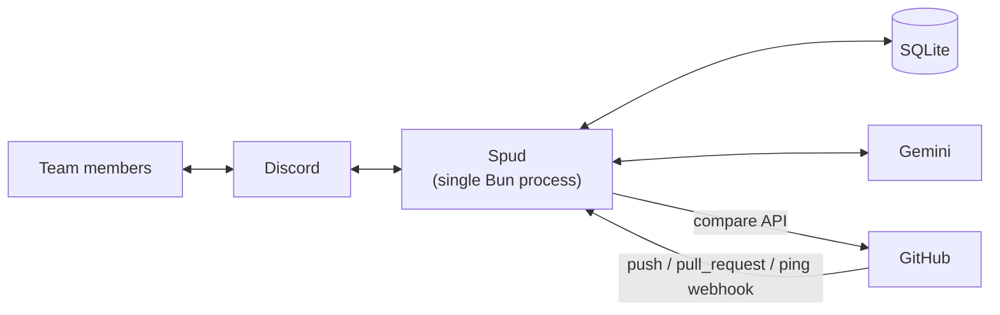
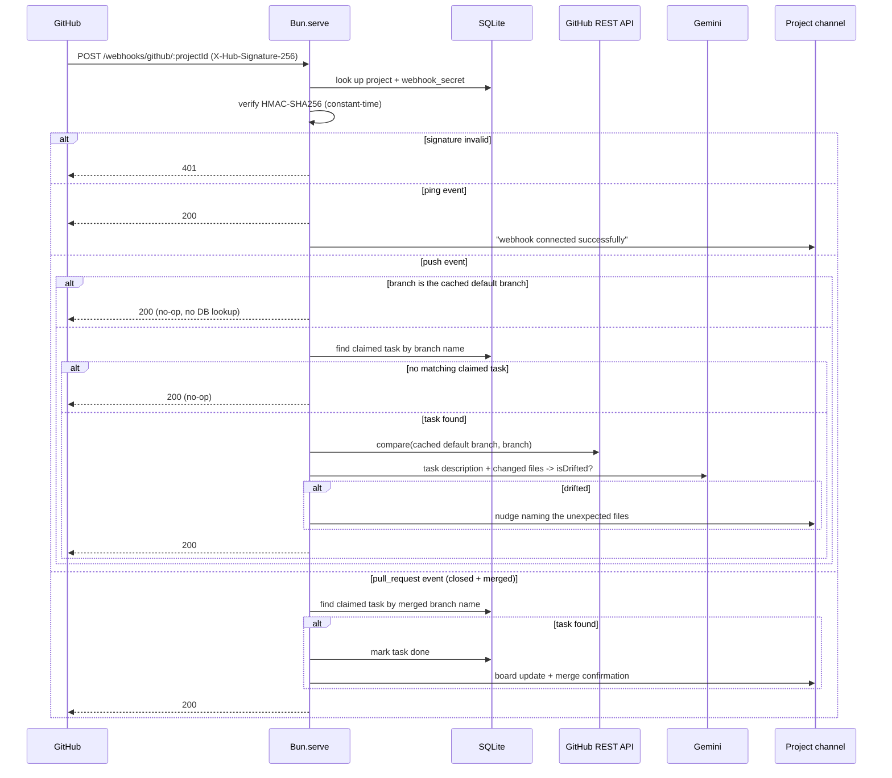

# Spud

A Discord bot for hackathon task coordination — a live claim board that shows who's working on what, catches two people building the same feature before it happens, and nudges someone if their branch quietly drifts outside the task they claimed.

## Features

### Project Lifecycle

A project is scoped to a **channel**, not the whole server, so one Discord server can host multiple concurrent hackathons/teams without collision. No task command works until someone starts one.

| Command | Access | Description |
|---|---|---|
| `/project start <title> <github-repo>` | Anyone | Starts a new active project in this channel, links a GitHub repo, generates a webhook secret. Whoever runs it becomes the project's **team lead** |
| `/project configure [start-time] [end-time] [rulebook]` | Team lead only | Sets or updates the project's timeline (parsed from natural language via `chrono-node`, e.g. "July 25 9am") and rulebook file. Any subset of fields can be provided per call |
| `/project end` | Team lead only | Ends the active project, archives (doesn't delete) its board/task data, unpins the board |
| `/project status` | Team lead only | Shows the active project's title, repo, task counts, timeline, and rulebook link |
| `/project list` | Server admin | Lists all active projects across the server (bird's-eye view, ephemeral) |

`/project start` is open to anyone — whoever runs it in a channel becomes that project's team lead, no `Administrator` permission required. `/project configure`, `/project end`, and `/project status` are then restricted to that specific Discord member — with **no admin override**. Only `/project list` requires Discord's `Administrator` permission, since it's a cross-channel, server-wide view. This mixed anyone/team-lead/admin model can't be expressed through Discord's per-command default-permission system (which applies to a whole command, not per-subcommand), so it's enforced in application code instead (see [authorization.ts](src/discord/authorization.ts)). A channel can only have one *active* project at a time, enforced at the database level (a partial unique index), not just in application code.

Team lead has no reassignment path yet — if the team lead leaves the server, `/project configure`/`end`/`status` become permanently unusable for that project (no admin fallback, no migration tool to patch it).

`/project start` only takes the bare minimum (title + repo); timeline and rulebook are set separately via `/project configure` since they might not be decided yet when the project is created. `/claim` refuses to run until both `start-time` and `end-time` are set. Timeline input is natural language (no timezone support — everything is parsed relative to the process's own local time), and the rulebook file is re-posted as a message in the project channel rather than storing the raw attachment URL, since Discord's CDN URLs carry a signed expiry but a message can always be re-fetched (or jumped to) for a fresh one.

### Claim Board

A pinned, auto-updating embed in the project's channel with three sections: 🟢 up for grabs, 🔧 in progress, ✅ done. It's created and pinned the moment `/project start` runs, and re-rendered on every claim/done/free/delete.

| Command | Description |
|---|---|
| `/claim <description>` | Claims an existing unclaimed task (autocompletes matching descriptions), or creates and claims a new one |
| `/tasks` | Shows the current board state on demand |
| `/done <branch>` | Marks a claimed task done (autocompletes claimed branches) |
| `/free <branch>` | Releases a claimed task back to unclaimed (autocompletes claimed branches) |
| `/delete <branch>` | Deletes a task of any status — unclaimed, claimed, or done (autocompletes across all branches) |

**Authorization:** `/done`, `/free`, and `/delete` only work for the task's current owner or a server admin — anyone else gets turned away. The one exception is deleting an *unclaimed* task, which has no owner to match against, so that specific case is admin-only.

### Overlap Detection + Branch Naming

When `/claim` is given free text that doesn't match an existing unclaimed task, it's treated as a brand-new task and a single Gemini call ([`llm/claim-analysis.ts`](src/llm/claim-analysis.ts)) does two things at once:

1. **Overlap check** — compares the new description against every other task's description on the board, regardless of status (unclaimed, claimed, or done). If it looks like a duplicate, the claim is **rejected** (not just warned) with a message naming the existing owner/task/branch and a nudge to retry with more detail.
2. **Branch naming** — generates a deterministic `type/kebab-slug` branch name (`feature`, `fix`, `chore`, `docs`, or `refactor`) from strict, ordered rules in a dedicated system prompt ([`llm/prompts/claim-analysis.ts`](src/llm/prompts/claim-analysis.ts)), so the same description always produces the same branch name. A collision-safety helper still appends `-2`, `-3`, etc. if two different descriptions land on the same slug.

Claiming an *existing* unclaimed task skips all of this — no LLM call, no new branch, since it was already checked when the task was first created.

### Scope-Drift Detection (GitHub webhook)

Catches "vibe coding" drift — claiming "auth" but also touching unrelated files — without anyone self-reporting.

- On `/project start`, the repo's default branch (not a hardcoded `main` — plenty of repos still use `master`) is fetched once and cached on the project row, and a webhook secret is generated and shown to the team lead (ephemeral, once) along with the payload URL, content type, and which events to select in GitHub's **Settings → Webhooks → Add webhook**.
- On every `push` whose branch isn't the cached default branch, the bot diffs it against that default branch via GitHub's compare API — pushes to the default branch itself are ignored before any database lookup, since they can never be a task's working branch.
- If the branch matches a currently-*claimed* task, the changed files + task description go to Gemini ([`llm/drift.ts`](src/llm/drift.ts)), which judges whether the diff still looks consistent with the task — biased toward not flagging, since a false alarm costs more trust than a missed one.
- If flagged, the bot posts a nudge in the project's channel naming the unexpected files.
- On the webhook's first `ping` event (sent automatically when GitHub adds the hook), the bot posts a one-time confirmation in the channel that the integration is live.
- Pushes on a branch with no matching claimed task are silently ignored — nothing breaks, it just doesn't get scope-checked.
- GitHub API calls are unauthenticated, so **the linked repo must be public**.

### Auto-close on merge (GitHub webhook)

- On a `pull_request` event with `action: closed` and `merged: true`, the bot reads the merged branch straight off the payload (`pull_request.head.ref`) — no extra API call needed.
- If that branch matches a currently-*claimed* task, the task is marked done automatically and the board updates, with a confirmation posted in the channel naming the PR.
- **Only detects merges done through GitHub's own merge/squash/rebase button** (i.e. via a pull request). A team that merges locally and pushes straight to the default branch won't trigger this — that push is a default-branch push, which is deliberately ignored (see above).

## Architecture

Everything runs as a **single Bun process** — the Discord gateway client and the webhook HTTP server both start from [`index.ts`](index.ts) and share the same SQLite database.



**Webhook request flow** in more detail — this is the part with the most moving pieces:



## Tech stack

| Concern | Choice |
|---|---|
| Runtime | [Bun](https://bun.com) |
| Discord | `discord.js` v14 |
| Database | `bun:sqlite` (built into Bun — no separate DB server) |
| Webhook HTTP server | `Bun.serve` (built-in — no Express/Hono) |
| LLM | `ai` (Vercel AI SDK) + `@ai-sdk/google`, Gemini |
| GitHub API | raw `fetch` (no `octokit`) |
| HMAC verification | Node/Bun built-in `crypto` |
| Validation | `zod` |

The only real dependencies are `discord.js`, `ai`, `@ai-sdk/google`, and `zod` — everything else rides on what Bun ships with.

## Local setup

**Prerequisites:**
- [Bun](https://bun.com) installed
- A Discord application + bot ([Developer Portal](https://discord.com/developers/applications)) — see below if you haven't made one
- A free Gemini API key from [Google AI Studio](https://aistudio.google.com/apikey)

**1. Install dependencies**

```bash
bun install
```

**2. Configure environment**

```bash
cp .env.example .env
```

| Variable | Required | Notes |
|---|---|---|
| `DISCORD_TOKEN` | yes | Bot token, from the Developer Portal's **Bot** page |
| `DISCORD_CLIENT_ID` | yes | Application ID, from **General Information** |
| `GOOGLE_GENERATIVE_AI_API_KEY` | yes | From Google AI Studio |
| `GEMINI_MODEL_NAME` | yes | e.g. `gemini-3.1-flash-lite` |
| `PORT` | no | Webhook server port, defaults to `3000` |
| `PUBLIC_BASE_URL` | no | Shown in `/project start`'s webhook setup message; without it you just get the raw path |

**3. Create and invite the bot** (skip if you already have one in your server)

1. [Developer Portal](https://discord.com/developers/applications) → **New Application**
2. **Bot** page → copy the token into `DISCORD_TOKEN`
3. **General Information** → copy the Application ID into `DISCORD_CLIENT_ID`
4. **OAuth2 → URL Generator** → scopes `bot` + `applications.commands`; permissions `Send Messages` and `Manage Messages` (needed to pin/unpin the board) → open the generated URL and invite it to your server

**4. Register slash commands and run**

```bash
bun run register-commands   # push commands to Discord (re-run after changing any command's shape)
bun run dev                 # or `bun run start` without file-watching
```

Try `/project start` in a channel as an admin, then `/claim`.

**Testing the GitHub webhook locally:** point `ngrok` (or similar) at your `PORT`, set `PUBLIC_BASE_URL` to the ngrok URL, and use the payload URL `/project start` gives you when adding the webhook on a public repo.

## Running with Docker

The [Dockerfile](Dockerfile) compiles the app to a standalone binary (`bun build --compile`) in a builder stage, then copies just that binary into a minimal `alpine` runtime image — no Bun runtime, no `node_modules`, no source in the final image. The SQLite file lives in the container's own writable layer with no volume — restarting the container loses the board, which is fine for personal/single-user use and keeps hosting as cheap as possible.

```bash
make build   # docker build -t spud .
make run     # docker run --env-file .env -p 3000:3000 --name spud -d spud
make logs    # docker logs -f spud
make stop    # docker stop spud
make start   # docker start spud
make rm      # docker rm -f spud
```

Note: `.env` values must be unquoted for `--env-file` to parse them correctly (Bun's own loader strips quotes, Docker's doesn't).

## Project structure

```
index.ts                     # entrypoint: init db, start webhook server, log in discord client
src/
  db.ts                       # schema + shared project queries
  tasks.ts                    # task queries/mutations + branch-name collision safety
  env.ts                      # env var loading/validation
  types.ts                    # Project, Task types
  discord/
    client.ts                  # Client instance + interaction dispatch/error handling
    board.ts                    # pinned board embed render/update/unpin
    authorization.ts             # owner-or-admin authorization gate
    autocomplete.ts               # shared autocomplete helper for task commands
    register-commands.ts          # one-off script to push slash commands to Discord
    commands/
      constants.ts                 # shared reply strings
      project/                     # /project start|configure|end|status|list
      tasks/                       # /claim, /tasks, /done, /free, /delete
  llm/
    client.ts                   # shared Gemini model instance
    claim-analysis.ts            # overlap check + branch naming (one call)
    drift.ts                      # scope-drift judgment
    prompts/                      # system prompts, kept separate from call logic
  github/
    verify.ts                   # HMAC-SHA256 webhook signature verification
    compare.ts                   # default branch lookup + compare API
    webhook.ts                   # Bun.serve routes (push/ping handling)
```

## Known limitations

- **No data persistence by default** — the Docker image stores SQLite in the container's own writable layer with no volume; restarting or redeploying wipes every project and task. Deliberate personal-use tradeoff (see "Running with Docker"), not a bug.
- **GitHub repos must be public** — the compare API is called unauthenticated, so private repos won't work, and you're subject to GitHub's 60 requests/hour unauthenticated rate limit.
- **Overlap detection can reject legitimate claims** — it's an LLM judgment call with no manual override; if it wrongly flags a genuinely different task as a duplicate, your only recourse is retrying `/claim` with a more detailed description.
- **Branch names must match exactly** — `/done`, `/free`, `/delete`, and drift-checking all key off the exact branch name the bot generated. Push to a differently-named branch and it's silently never scope-checked — by design, not a crash.
- **Single instance only** — one SQLite file and one Discord gateway connection per process; this isn't built to run as multiple replicas behind a load balancer.
- **No schema migrations** — schema changes are hand-written `CREATE TABLE`/column edits with no migration tool. Given the "OK to lose data" stance that's intentional, but existing rows won't pick up new columns without a fresh database.
- **No multi-timezone support** — `/project configure`'s natural-language timeline input (via `chrono-node`) is always parsed as Bangladesh Standard Time (UTC+6), regardless of who's typing or where the bot runs. Fine for a single BD-based team, not for a distributed one.
- **Team lead has no reassignment path** — `/project configure`, `/project end`, and `/project status` are gated to the team lead (whoever ran `/project start`) with no admin override. If that person leaves the server, those subcommands become permanently unusable for that project — there's no command to reassign team lead and no migration tool to patch the `team_lead` column by hand.
- **Default branch is cached, not re-checked** — the repo's default branch is fetched once at `/project start` and reused for every push/drift comparison after that. If the repo's default branch is renamed later (e.g. `master` → `main`), the project won't notice — the only fix is ending and restarting the project.
