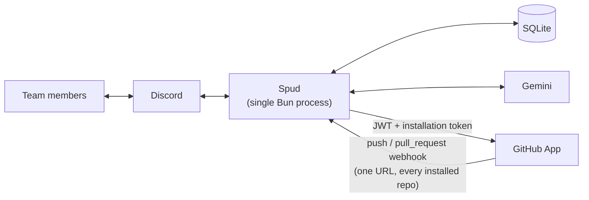
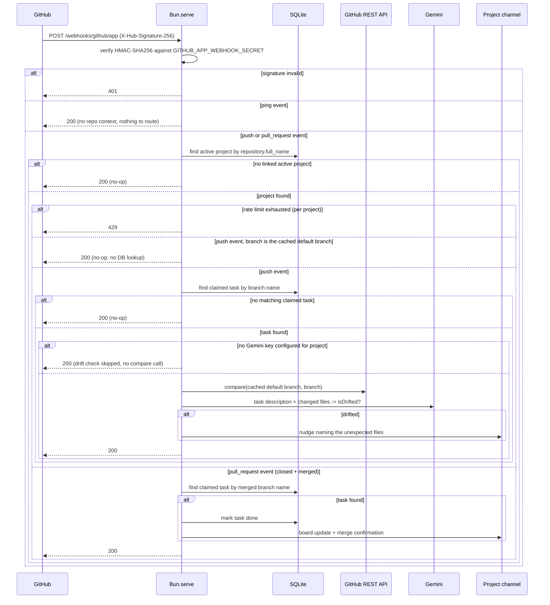

# Spud

A Discord bot for small team task coordination — a live claim board, duplicate-claim detection, and nudges when someone's branch drifts outside the task they claimed.

**[Add Spud to your server](https://discord.com/oauth2/authorize?client_id=1528332173378326671&permissions=10240&scope=bot%20applications.commands)** — not in Discord's App Directory yet, but the invite link works the same. Run `/help` once it's in.

## Features

**Project** — one active project per channel, linked to a GitHub repo the [GitHub App](#github-app) is installed on (public or private both work). `/project start` makes you the team lead; only you can reconfigure/end it after.

| Command | Access | Description |
|---|---|---|
| `/project start <title> <github-repo>` | Anyone | Starts a project in this channel, becomes its team lead |
| `/project configure [start-time] [end-time] [handbook]` | Team lead | Sets the timeline (natural language, e.g. "July 25 9am") and/or a handbook file |
| `/project end` | Team lead | Ends the project, archives its data, unpins the board |
| `/project status` | Team lead | Shows title, repo, task counts, timeline, handbook link |
| `/project list` | Admin | Lists all active projects in the server |
| `/project set-gemini-key` | Team lead | Sets/removes this project's Gemini key |

**Claim board** — a pinned, auto-updating board per channel: 🟢 up for grabs, 🔧 in progress, ✅ done.

| Command | Description |
|---|---|
| `/claim <description>` | Claims an existing task, or creates and claims a new one |
| `/tasks` | Shows the current board |
| `/done <branch>` | Marks a claimed task done |
| `/free <branch>` | Releases a claimed task back to unclaimed |
| `/delete <branch>` | Deletes a task |

`/done`, `/free`, and `/delete` only work for the task's owner or a server admin.

**AI features (optional, highly recommended)** — Gemini-powered duplicate-claim detection, branch naming, and scope-drift nudges on pushes; this is what makes the bot actually useful. Off by default; each project supplies its own key via `/project set-gemini-key` (stored encrypted).

**Auto-close on merge** — merging a claimed branch's PR marks its task done automatically.

### GitHub App

Spud connects to GitHub through its own GitHub App — read-only Contents, Metadata, and Pull requests permissions, no OAuth, no stored tokens. **The App must be installed on a repo before `/project start` can link it**, for both public and private repos. One App-level webhook covers every installed repo.

## Architecture

Everything runs as a single Bun process — the Discord gateway client and the webhook HTTP server both start from [`index.ts`](index.ts) and share the same SQLite database.



**Webhook request flow** in more detail:



## Tech stack

| Concern | Choice |
|---|---|
| Runtime | [Bun](https://bun.sh) |
| Discord | `discord.js` v14 |
| Database | `@libsql/client` — [Turso](https://turso.tech), or a local SQLite file |
| Webhook HTTP server | `Bun.serve` (built-in) |
| LLM | `ai` (Vercel AI SDK) + `@ai-sdk/google`, Gemini |
| GitHub API | raw `fetch`; GitHub App JWT auth via built-in `crypto` |
| Validation | `zod` |
| Date parsing | `chrono-node` |
| Logging | `winston` + `winston-loki`, optionally to Grafana Cloud Loki |

## Local setup

**Prerequisites:**
- [Bun](https://bun.sh) installed
- A Discord application + bot ([Developer Portal](https://discord.com/developers/applications)) — see below if you haven't made one
- A GitHub App ([github.com/settings/apps](https://github.com/settings/apps)) — **required**, see [GitHub App](#github-app) above and setup below
- Recommended: a Gemini API key, set per-project via `/project set-gemini-key` — see [AI features](#features) above

**1. Install dependencies**

```bash
bun install
```

**2. Configure environment**

```bash
cp .env.example .env
```

| Variable | Required | Notes |
|---|---|---|
| `DISCORD_TOKEN` | yes | Bot token (Developer Portal → Bot) |
| `DISCORD_CLIENT_ID` | yes | Application ID (Developer Portal → General Information) |
| `GEMINI_MODEL_NAME` | yes | e.g. `gemini-3.1-flash-lite` |
| `ENCRYPTION_KEY` | yes | 32-byte key for encrypting stored Gemini keys — `openssl rand -base64 32` |
| `GITHUB_APP_ID` | yes | From your GitHub App's settings page |
| `GITHUB_APP_SLUG` | yes | From the App's URL: `github.com/apps/<slug>` |
| `GITHUB_APP_PRIVATE_KEY` | yes | The App's private key `.pem`, quoted as-is in `.env` |
| `GITHUB_APP_WEBHOOK_SECRET` | yes | Secret set on the App's Webhook settings page |
| `PORT` | no | Defaults to `3000` |
| `PUBLIC_BASE_URL` | no | Landing-page link shown in `/help` |
| `TURSO_DATABASE_URL` | no | Turso DB URL — falls back to local SQLite if unset |
| `TURSO_AUTH_TOKEN` | no | Must be a **database** token, not account-level |
| `DATABASE_PATH` | no | Local SQLite path, defaults to `spud.sqlite` |
| `LOG_LEVEL` | no | `debug`/`info`/`warn`/`error`, defaults to `info` |
| `LOKI_HOST` | no | Grafana Cloud Loki URL — logs ship only if all three Loki vars are set |
| `USER_ID` | no | Grafana Cloud Loki instance ID |
| `GRAFANA_CLOUD_TOKEN` | no | Grafana Cloud API token |

**3. Create and invite the bot** (skip if you already have one)

1. [Developer Portal](https://discord.com/developers/applications) → **New Application**
2. **Bot** page → copy the token into `DISCORD_TOKEN`
3. **General Information** → copy the Application ID into `DISCORD_CLIENT_ID`
4. **OAuth2 → URL Generator** → scopes `bot` + `applications.commands`; permissions `Send Messages` and `Manage Messages` → open the generated URL and invite it to your server

**4. Create the GitHub App** (skip if you already have one)

1. [github.com/settings/apps](https://github.com/settings/apps) → **New GitHub App**
2. **Webhook**: check **Active**, set the URL to `<your public URL>/webhooks/github/app`, set a **Secret** → copy it into `GITHUB_APP_WEBHOOK_SECRET`
3. **Repository permissions**: **Contents**, **Metadata**, **Pull requests** — all Read-only
4. **Subscribe to events**: **Push** and **Pull request**
5. Create the App → copy its **App ID** into `GITHUB_APP_ID` and its slug (`github.com/apps/<slug>`) into `GITHUB_APP_SLUG`
6. **Generate a private key** → paste its contents into `GITHUB_APP_PRIVATE_KEY` (quoted in `.env`)
7. **Install App** on whichever account/repos you want Spud to access

**5. Register slash commands and run**

```bash
bun run register-commands   # push commands to Discord (re-run after changing any command's shape)
bun run dev                 # or `bun run start` without file-watching
```

Try `/project start` with a repo the App is installed on, then `/claim`. To test the webhook locally, point `ngrok` (or similar) at your `PORT` and set the App's Webhook URL to `<ngrok URL>/webhooks/github/app`.

## Running with Docker

The [Dockerfile](Dockerfile) runs `bun run index.ts` on a normal `bun install --production` rather than a compiled binary, since `@libsql/client` needs a platform-specific native binding resolved at runtime. Without `TURSO_DATABASE_URL` set, data lives only in the container's writable layer and is lost on restart.

```bash
make build   # docker build -t spud .
make run     # docker run --env-file .env -p 3000:3000 --name spud -d spud
make logs    # docker logs -f spud
make stop    # docker stop spud
make start   # docker start spud
make rm      # docker rm -f spud
```

Note: `.env` values must be unquoted for `--env-file` to parse them correctly.

## Known limitations

- No data persistence without Turso configured — falls back to local SQLite, wiped on restart/redeploy.
- GitHub App must be installed before linking a repo — public or private, no exceptions.
- Overlap detection is an LLM judgment call — no manual override if it wrongly flags a duplicate.
- Branch names must match exactly — pushes to a differently-named branch aren't scope-checked.
- Single instance only — not built for multiple replicas; rate limiting is in-memory.
- No schema migrations — existing rows won't get new columns without a fresh database.
- Timeline input has no timezone support — always parsed as UTC+6 (Bangladesh time).
- No team lead reassignment — if they leave the server, that project's admin commands stop working.
- Default branch is cached at project start — renaming it later isn't picked up.
- AI features are silently opt-in — no periodic reminder if no Gemini key is set.
